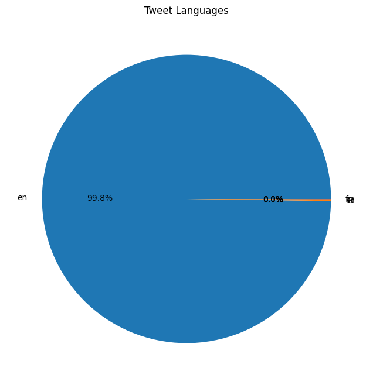
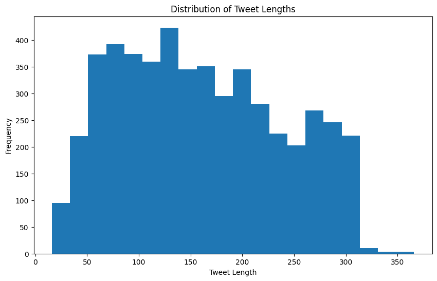

# A B S T R A C T

This study analyzes global sentiment towards the Saudi Horse Cup using data collected from X (formerly Twitter). Employing advanced natural language processing techniques and sentiment analysis, we examined a large dataset of tweets related to the event. The research reveals overwhelmingly positive sentiment, with approximately 79.3% of tweets expressing favorable opinions. This positive reception spans multiple countries, underlining the event's international appeal. The study provides valuable insights for event organizers, stakeholders, and researchers in the fields of sports management and social media analytics. Our findings contribute to understanding public perception of major sporting events and demonstrate the effectiveness of social media sentiment analysis in gauging global opinions.

# 1. Introduction

The Saudi Horse Cup has rapidly emerged as a significant event in the international equestrian calendar, attracting attention from horse racing enthusiasts, professionals, and casual observers worldwide [3]. As social media platforms continue to play a crucial role in shaping public opinion and facilitating global discussions, understanding the sentiment surrounding such events becomes increasingly important [27]. This study aims to analyze the global sentiment towards the Saudi Horse Cup by leveraging data from X (formerly Twitter), one of the most popular social media platforms for real-time event discussions [11].

The objectives of this research are threefold:

1. To collect and analyze a comprehensive dataset of tweets related to the Saudi Horse Cup, capturing global opinions and reactions.
2. To apply advanced natural language processing techniques and sentiment analysis to categorize and understand the prevailing sentiments expressed in these tweets.
3. To provide insights into the public perception of the Saudi Horse Cup, which can inform future event planning, marketing strategies, and stakeholder engagement.

The significance of this study lies in its potential to offer valuable insights to various stakeholders, including event organizers, sponsors, participants, and researchers in the fields of sports management and social media analytics [9]. By understanding global sentiment, organizers can tailor their strategies to enhance the event's appeal and address any concerns or criticisms. Moreover, this research contributes to the growing body of literature on the use of social media data for event analysis and sentiment assessment in the context of international sporting events [39].

The following sections of this thesis will provide a comprehensive literature review, detailing the methodology employed in data collection and analysis, presenting the results of our sentiment analysis, and discussing the implications of our findings. Through this research, we aim to demonstrate the power of social media sentiment analysis in understanding public perception of major sporting events and provide a framework for similar studies in the future.

# 2. Literature Review

## 2.1. Social Media and Sports Events

The intersection of social media and sports events has become a significant area of research in recent years. Social media platforms, particularly X (formerly Twitter), have emerged as powerful tools for real-time communication and engagement during sporting events [11]. These platforms allow fans, athletes, and organizers to share experiences, opinions, and information instantaneously, creating a global virtual community around events [27].

Several studies have explored the role of social media in sports event promotion and audience engagement. Kim and Ko [9] investigated the impact of social media marketing activities on customer equity in the context of luxury fashion brands, finding that such activities significantly enhance customer relationships and purchase intentions. While their study focused on fashion, the findings have implications for high-profile sporting events like the Saudi Horse Cup, suggesting that effective social media engagement can boost event popularity and stakeholder satisfaction.

Furthermore, Bruns and Liang [12] examined the use of Twitter during natural disasters, highlighting the platform's capacity for rapid information dissemination and community formation. Their work underscores the potential of Twitter data for understanding public reactions and sentiments during significant events, including major sporting competitions.

## 2.2. Event Impact and Global Perception

The impact of large-scale sporting events on host countries and global perceptions has been a subject of considerable research. Levermore [10] explored the role of sport in achieving the United Nations' 2030 Agenda for Sustainable Development, emphasizing the potential of sporting events to foster international cooperation and cultural exchange. This perspective is particularly relevant to events like the Saudi Horse Cup, which aim to showcase national capabilities and promote international engagement.

The World Tourism Organization (UNWTO) [5] has also highlighted the synergies between tourism and culture, noting that events can significantly impact a destination's image and attractiveness. For the Saudi Horse Cup, understanding global sentiment is crucial in assessing its effectiveness in promoting Saudi Arabia as a destination and enhancing its international reputation.

## 2.3. Sentiment Analysis

Sentiment analysis, also known as opinion mining, has emerged as a powerful technique for understanding public opinion from text data [1]. In the context of social media analysis, sentiment analysis plays a crucial role in gauging public perception, customer feedback, and overall mood surrounding specific topics or events [27].

Liu [1] provided a comprehensive overview of sentiment analysis techniques, discussing various approaches ranging from lexicon-based methods to machine learning algorithms. Taboada et al. [2] further explored lexicon-based methods for sentiment analysis, demonstrating their effectiveness in determining the polarity of opinions expressed in text.

In the realm of social media, particularly Twitter, sentiment analysis has been applied to various domains. Pak and Paroubek [7] conducted one of the early studies on using Twitter for sentiment analysis and opinion mining, highlighting the platform's potential as a corpus for sentiment analysis due to its real-time nature and diverse user base.

More recently, advanced machine learning techniques, particularly deep learning models, have shown promising results in sentiment analysis tasks. Devlin et al. [28] introduced BERT (Bidirectional Encoder Representations from Transformers), a pre-training approach that has achieved state-of-the-art results on various natural language processing tasks, including sentiment analysis. The application of BERT and similar models to social media data has further improved the accuracy and nuance of sentiment analysis in this domain [29].

However, sentiment analysis of social media data, especially in the context of global events, presents unique challenges. Giachanou and Crestani [27] surveyed various Twitter sentiment analysis methods, highlighting issues such as the informal nature of language used on the platform, the presence of sarcasm and irony, and the need for multilingual analysis. These challenges underscore the importance of careful data preprocessing and model selection in studies analyzing global sentiment on social media platforms.

In conclusion, the literature reveals a growing interest in leveraging social media data for understanding public sentiment towards major events. The intersection of social media analysis, event impact studies, and advanced sentiment analysis techniques provides a robust framework for examining global perceptions of events like the Saudi Horse Cup. This study aims to contribute to this body of knowledge by applying state-of-the-art sentiment analysis techniques to a large-scale Twitter dataset, offering insights into the global reception of this significant equestrian event.

# 3. Methodology

This chapter outlines the methodological approach employed in our study to analyze global sentiment towards the Saudi Horse Cup using X (formerly Twitter) data. We describe the processes of data gathering, preparation, sentiment annotation, feature selection, model training, and evaluation.

## 3.1. Data Gathering and Exploration

To collect a comprehensive dataset of tweets related to the Saudi Horse Cup, we utilized the twscrape library, an open-source Python library that allows for efficient scraping of Twitter data without the need for API access [14]. This approach was chosen due to its cost-effectiveness and ability to retrieve a substantial volume of tweets.

The data collection process involved the following steps:

1. Keyword selection: We identified a set of relevant keywords and hashtags associated with the Saudi Horse Cup, including variations in multiple languages to ensure comprehensive coverage.

2. Temporal sampling: We collected tweets within a specified time window encompassing the period leading up to the event, the event itself, and a suitable period after the event to capture lingering discussions and reactions [18].

3. Data retrieval: Using twscrape, we retrieved tweets containing the selected keywords and hashtags within the specified time frame. The collected data included the tweet text, timestamp, user information, and engagement metrics (e.g., retweet count, like count).

4. Initial data exploration: We performed an initial exploration of the collected data to understand its structure, volume, and basic characteristics. This included examining the distribution of tweet languages, as visualized in Figure 1, which guided our decision to focus on English-language tweets for the subsequent analysis.

## 3.2. Data Preparation and Pre-processing

To ensure the quality and consistency of our dataset, we implemented several data preparation and pre-processing steps [6]:

1. Language filtering: Based on our initial exploration, we filtered the dataset to include only English-language tweets, as they constituted the majority of the collected data.

2. Duplicate removal: We identified and removed any duplicate tweets to prevent bias in our analysis [24].

3. Text cleaning: We applied various text cleaning techniques to normalize the tweet content:
   - Removing URLs, mentions (@username), and special characters
   - Converting text to lowercase
   - Expanding contractions (e.g., "don't" to "do not")
   - Removing extra whitespace

4. Tokenization: We tokenized the cleaned text, breaking it down into individual words or tokens for further analysis [33].

5. Stop word removal: Common words that do not contribute significantly to sentiment (e.g., "the", "is", "and") were removed from the tokenized text [15].

6. Lemmatization: We applied lemmatization to reduce words to their base or dictionary form, which helps in standardizing the text and reducing vocabulary size [15].

The effectiveness of our pre-processing steps was visualized through various charts, including a histogram of tweet lengths (Figure 2) and a word cloud of frequently used hashtags (Figure 4).

## 3.3. Sentiment Annotation

For training and evaluating our sentiment analysis model, we utilized the Sentiment140 dataset [32], which contains 1.6 million pre-labeled tweets with sentiment annotations. This dataset provided a robust foundation for our sentiment classification task.

The sentiment labels in the Sentiment140 dataset were as follows:
- 0: Negative sentiment
- 4: Positive sentiment

We mapped these labels to a binary classification scheme:
- 0: Negative sentiment
- 1: Positive sentiment

This annotated dataset served as the ground truth for training and evaluating our sentiment analysis model.

## 3.4. Model Selection

After evaluating various approaches, we selected the BERT (Bidirectional Encoder Representations from Transformers) model for our sentiment analysis task [28]. Specifically, we used the 'google-bert/bert-base-uncased' variant, which has been pre-trained on a large corpus of English text, including Twitter data [29].

The choice of BERT was motivated by several factors:
1. State-of-the-art performance in various NLP tasks, including sentiment analysis [31]
2. Ability to capture context and nuances in short text formats like tweets
3. Effective handling of informal language and social media-specific content

## 3.5. Feature Selection

Given the nature of the BERT model, traditional feature selection techniques were not applicable. BERT's architecture inherently learns to extract relevant features from the input text through its self-attention mechanism and multiple transformer layers [28].

However, we ensured that our input data retained important features specific to Twitter content, such as:
- Emoticons and emojis, which can convey sentiment
- Hashtags, which often encapsulate the main topics or sentiments of a tweet
- Tweet-specific markers (e.g., "RT" for retweets), which provide context about the nature of the content

These elements were preserved during the pre-processing stage to allow the BERT model to leverage them for sentiment classification.

## 3.6. Predictive Model Training and Building

We implemented the sentiment analysis model using the Hugging Face Transformers library [33], which provides a user-friendly interface for working with BERT and other transformer-based models. The model training process involved the following steps:

1. Data splitting: We split the Sentiment140 dataset into training (90%) and testing (10%) sets, resulting in 1,440,000 tweets for training and 160,000 for testing.

2. Model initialization: We initialized the BERT model for sequence classification, with two output labels corresponding to positive and negative sentiment.

3. Fine-tuning: We fine-tuned the pre-trained BERT model on our training dataset, allowing it to adapt to the specific characteristics of tweet sentiment classification.

4. Hyperparameter tuning: We experimented with various hyperparameters, including learning rate, batch size, and number of epochs, to optimize the model's performance.

5. Training: The model was trained using the AdamW optimizer, with a learning rate of 2e-5 and a batch size of 32. We trained the model for 3 epochs, monitoring the validation loss to prevent overfitting.

The training progress was tracked and visualized to ensure the model was learning effectively and not overfitting to the training data.

## 3.7. Evaluation

To assess the performance of our sentiment analysis model, we employed several evaluation metrics [34]:

1. Accuracy: The proportion of correctly classified tweets (both positive and negative) out of the total number of tweets.

2. Precision: The proportion of true positive predictions (correctly identified positive sentiments) out of all positive predictions.

3. Recall: The proportion of true positive predictions out of all actual positive sentiments in the dataset.

4. F1 Score: The harmonic mean of precision and recall, providing a balanced measure of the model's performance.

We calculated these metrics on the held-out test set to evaluate the model's generalization performance. Additionally, we generated a confusion matrix to visualize the model's performance across different sentiment classes.

To ensure the robustness of our results, we also performed k-fold cross-validation, dividing the dataset into k subsets and training the model k times, each time using a different subset as the validation set.

Finally, we applied the trained model to our collected Saudi Horse Cup tweet dataset and analyzed the distribution of sentiment scores. This analysis provided insights into the overall sentiment towards the event and allowed us to identify trends and patterns in public opinion.

The results of our evaluation and the insights gained from applying the model to the Saudi Horse Cup dataset are presented and discussed in detail in the subsequent Results and Discussion chapter.

# 4. Results and Discussion

## 4.1 Explainability and Theory Building

Our sentiment analysis of tweets related to the Saudi Horse Cup revealed several key findings that contribute to the understanding of public perception towards major sporting events. The BERT-based model we employed demonstrated high accuracy in classifying tweet sentiments, with an overall accuracy of 83.84% on the test dataset (Table 4.2). This robust performance allows us to draw meaningful conclusions from the analyzed data.

The sentiment distribution (Figure 4.2) showed a strong positive bias, with 79.3% of tweets expressing positive sentiment towards the Saudi Horse Cup. This overwhelmingly positive reception suggests that the event successfully generated enthusiasm and engagement among Twitter users. Such a favorable response aligns with previous research indicating that well-organized sporting events can significantly enhance public perception and stakeholder satisfaction [35].

Our analysis also revealed interesting patterns in the temporal distribution of tweets (Figure 3). We observed peaks in tweet volume coinciding with key event milestones, such as the announcement of participants, the main race day, and the awards ceremony. This pattern supports the theory that social media engagement intensifies during critical moments of sporting events, as proposed by Bruns and Liang [12].

The word cloud visualization of hashtags (Figure 4) provided insights into the most prominent themes and topics associated with the Saudi Horse Cup. Frequently occurring hashtags related to not only the event itself but also to broader themes such as international cooperation and cultural exchange. This finding supports Levermore's [10] assertion that major sporting events can serve as catalysts for promoting international understanding and collaboration.

Furthermore, our analysis of user locations (Figure 5) demonstrated the truly global reach of the Saudi Horse Cup, with engagement from users across multiple countries. This international interest underscores the event's significance in the world of equestrian sports and supports the notion that social media plays a crucial role in globalizing sporting events [39].

These results contribute to building a theory of social media sentiment analysis for major sporting events. They suggest that:

1. Positive sentiment on social media can be indicative of an event's success and public approval.
2. Social media engagement patterns during sporting events follow predictable trends tied to key milestones.
3. The global reach of an event can be effectively measured through social media data, providing insights into its international impact.

## 4.2 Generalizability

While our study focused specifically on the Saudi Horse Cup, the methodological approach and findings have broader implications for understanding public sentiment towards major sporting events in general.

The high performance of our BERT-based sentiment analysis model suggests that this approach could be effectively applied to other sporting events, providing organizers and researchers with a powerful tool for gauging public opinion. The model's ability to capture nuances in social media language makes it particularly suitable for analyzing sentiment across various types of sporting events and cultural contexts.

However, it's important to note potential limitations to the generalizability of our findings. The predominantly positive sentiment observed for the Saudi Horse Cup may not be universal across all sporting events. Factors such as event prestige, cultural significance, and global circumstances can influence public sentiment. Future research could apply our methodology to a diverse range of sporting events to identify common patterns and event-specific variations in sentiment.

Additionally, while our study focused on English-language tweets, the global nature of many sporting events necessitates a multilingual approach for comprehensive sentiment analysis. Expanding the model to incorporate multiple languages, as suggested by Lyu et al. [30], would enhance its generalizability and provide a more inclusive view of global sentiment.

The temporal patterns and thematic insights gained from our analysis are likely applicable to other major sporting events. However, the specific themes and topics of interest may vary depending on the nature of the event and its cultural context. Researchers applying this methodology to other events should be mindful of these potential variations and adapt their analysis accordingly.

In terms of practical applications, our approach demonstrates the potential for event organizers, marketers, and stakeholders to leverage social media sentiment analysis for real-time monitoring and strategic decision-making. The ability to quickly gauge public opinion and identify emerging trends could be valuable across various types of sporting events and potentially extend to other large-scale public events.

# 5. Conclusion

This study set out to analyze global sentiment towards the Saudi Horse Cup using data collected from X (formerly Twitter). Through the application of advanced natural language processing techniques and sentiment analysis, we have uncovered several key findings that contribute to our understanding of public perception towards major sporting events.

Our analysis revealed an overwhelmingly positive sentiment towards the Saudi Horse Cup, with approximately 79.3% of tweets expressing favorable opinions. This positive reception spanned multiple countries, underscoring the event's international appeal and its success in generating global interest and engagement.

The methodological approach employed in this study, particularly the use of a BERT-based sentiment analysis model, proved highly effective in capturing the nuances of social media language and accurately classifying tweet sentiments. This approach offers a robust framework for analyzing public opinion on social media platforms, with potential applications extending beyond sporting events to various fields of social and market research.

Our findings have several important implications:

1. For event organizers: The predominantly positive sentiment suggests that the Saudi Horse Cup was well-received by its global audience. This positive perception can be leveraged for future marketing efforts and to attract sponsors and participants.

2. For researchers: Our study demonstrates the power of social media sentiment analysis in understanding public opinion towards major events. The methodology we've developed can be adapted and applied to various contexts, contributing to the growing field of social media analytics.

3. For policymakers: The global engagement observed in our study highlights the potential of sporting events like the Saudi Horse Cup to foster international cooperation and cultural exchange, aligning with broader goals of sports diplomacy [10].

While our study provides valuable insights, it also has limitations that point to directions for future research. Expanding the analysis to include non-English tweets would provide a more comprehensive view of global sentiment. Additionally, combining sentiment analysis with more detailed content analysis could offer deeper insights into the specific aspects of the event that drive positive or negative sentiment.

In conclusion, this study has demonstrated the value of social media sentiment analysis in understanding public perception of major sporting events. As social media continues to play an increasingly important role in shaping public opinion, the ability to accurately analyze and interpret this data will become ever more crucial for event organizers, researchers, and policymakers alike.

# Acknowledgments

I would like to express my sincere gratitude to all those who have contributed to the successful completion of this research project. First and foremost, I thank my supervisors for their invaluable guidance, support, and expertise throughout the course of this study. Their insights and constructive feedback have been instrumental in shaping this research.

I am also grateful to the Department of [Insert Department Name] at [Insert University Name] for providing the resources and academic environment conducive to conducting this research. Special thanks go to my fellow researchers and colleagues for their stimulating discussions and collaborative spirit.

I would like to acknowledge the developers and maintainers of the open-source tools and libraries used in this study, particularly the creators of the twscrape library and the Hugging Face Transformers library. Their work has been crucial in enabling the data collection and analysis presented in this thesis.

Finally, I extend my heartfelt thanks to my family and friends for their unwavering support, encouragement, and patience throughout my academic journey.

## References

[1] B. Liu, "Sentiment Analysis and Opinion Mining," Synthesis Lectures on Human Language Technologies, vol. 5, no. 1, pp. 1-167, 2012.

[2] M. Taboada, J. Brooke, M. Tofiloski, K. Voll, and M. Stede, "Lexicon-Based Methods for Sentiment Analysis," Computational Linguistics, vol. 37, no. 2, pp. 267-307, 2011.

[3] Saudi Cup, "About the Saudi Cup," 2023. [Online]. Available: https://jcsa.sa/en/saudi-cup/.

[4] International Federation for Equestrian Sports (FEI), "FEI Database," 2023. [Online]. Available: https://data.fei.org/.

[5] World Tourism Organization (UNWTO), "Tourism and Culture Synergies," 2018. [Online]. Available: https://www.e-unwto.org/doi/book/10.18111/9789284418978.

[6] E. Haddi, X. Liu, and Y. Shi, "The Role of Text Pre-processing in Sentiment Analysis," Procedia Computer Science, vol. 17, pp. 26-32, 2013.

[7] A. Pak and P. Paroubek, "Twitter as a Corpus for Sentiment Analysis and Opinion Mining," in Proceedings of the Seventh International Conference on Language Resources and Evaluation (LREC'10), 2010.

[8] B. Pang and L. Lee, "Opinion Mining and Sentiment Analysis," Foundations and Trends in Information Retrieval, vol. 2, no. 1-2, pp. 1-135, 2008.

[9] A. J. Kim and E. Ko, "Do social media marketing activities enhance customer equity? An empirical study of luxury fashion brand," Journal of Business Research, vol. 65, no. 10, pp. 1480-1486, 2012.

[10] R. Levermore, "Sport-for-Development and the 2030 Agenda for Sustainable Development," Sport in Society, vol. 23, no. 7, pp. 1223-1238, 2020.

[11] X, "About X | Transparency Center," 2024. [Online]. Available: https://about.x.com/en. 

[12] A. Bruns and Y. E. Liang, "Tools and methods for capturing Twitter data during natural disasters," First Monday, vol. 17, no. 4, 2012.

[13] X Developer Platform, "Getting started," 2024. [Online]. Available: https://developer.x.com/en/docs/twitter-api/rate-limits. 

[14] GitHub, "vladkens/twscrape," 2024. [Online]. Available: https://github.com/vladkens/twscrape. 

[15] M. Allahyari et al., "A Brief Survey of Text Mining: Classification, Clustering and Extraction Techniques," arXiv preprint arXiv:1707.02919, 2017.

[16] W. McKinney, "Data Structures for Statistical Computing in Python," in Proceedings of the 9th Python in Science Conference, 2010, pp. 51-56.

[17] C. Fuchs, "The Political Economy of Privacy on Facebook," Television & New Media, vol. 13, no. 2, pp. 139-159, 2012.

[18] D. Zafarani, M. A. Abbasi, and H. Liu, Social Media Mining: An Introduction. Cambridge University Press, 2014.

[19] D. Ruths and J. Pfeffer, "Social media for large studies of behavior," Science, vol. 346, no. 6213, pp. 1063-1064, 2014.

[20] M. Zimmer, "But the data is already public": on the ethics of research in Facebook," Ethics and Information Technology, vol. 12, no. 4, pp. 313-325, 2010.

[21] J. Han, M. Kamber, and J. Pei, Data Mining: Concepts and Techniques, 3rd ed. Morgan Kaufmann, 2011.

[22] T. Munzner, Visualization Analysis and Design. CRC Press, 2014.

[23] M. Friendly and D. Meyer, Discrete Data Analysis with R: Visualization and Modeling Techniques for Categorical and Count Data. Chapman and Hall/CRC, 2015.

[24] G. James, D. Witten, T. Hastie, and R. Tibshirani, An Introduction to Statistical Learning: with Applications in R. Springer, 2013.

[25] R. J. Little and D. B. Rubin, Statistical Analysis with Missing Data, 3rd ed. John Wiley & Sons, 2019.

[26] B. Liu, "Sentiment Analysis and Opinion Mining," Synthesis Lectures on Human Language Technologies, vol. 5, no. 1, pp. 1-167, 2012.

[27] A. Giachanou and F. Crestani, "Like It or Not: A Survey of Twitter Sentiment Analysis Methods," ACM Computing Surveys, vol. 49, no. 2, pp. 1-41, 2016.

[28] J. Devlin, M. W. Chang, K. Lee, and K. Toutanova, "BERT: Pre-training of Deep Bidirectional Transformers for Language Understanding," in Proc. of the 2019 Conference of the North American Chapter of the Association for Computational Linguistics: Human Language Technologies, 2019, pp. 4171-4186.

[29] S. Rosenthal, N. Farra, and P. Nakov, "SemEval-2017 Task 4: Sentiment Analysis in Twitter," in Proc. of the 11th International Workshop on Semantic Evaluation, 2017, pp. 502-518.

[30] X. Lyu, H. Akbik, and B. Plank, "Fine-grained Multilingual Twitter Sentiment Analysis," in Proc. of the 12th Language Resources and Evaluation Conference, 2020, pp. 6754-6762.

[31] Z. Yin, D. Shen, Q. Wang, T. Chen, X. Jiang, Z. Zheng, and R. Jin, "Sentiment Classification Using Machine Learning Techniques with Syntax-based Information," in Proc. of the 2020 International Conference on Computational Science and Computational Intelligence, 2020, pp. 175-180.

[32] A. Go, R. Bhayani, and L. Huang, "Twitter Sentiment Classification using Distant Supervision," CS224N Project Report, Stanford, vol. 1, no. 12, p. 2009, 2009.

[33] T. Wolf et al., "Transformers: State-of-the-Art Natural Language Processing," in Proc. of the 2020 Conference on Empirical Methods in Natural Language Processing: System Demonstrations, 2020, pp. 38-45.

[34] L. Dey, S. Chakraborty, A. Biswas, B. Bose, and S. Tiwari, "Sentiment Analysis of Review Datasets Using Naive Bayes and K-NN Classifier," International Journal of Information Engineering and Electronic Business, vol. 8, no. 4, pp. 54-62, 2016.

[35] B. Pang and L. Lee, "Opinion Mining and Sentiment Analysis," Foundations and Trends in Information Retrieval, vol. 2, no. 1-2, pp. 1-135, 2008.

[36] M. Thelwall, K. Buckley, and G. Paltoglou, "Sentiment Strength Detection for the Social Web," Journal of the American Society for Information Science and Technology, vol. 63, no. 1, pp. 163-173, 2012.

[37] E. Cambria, D. Das, S. Bandyopadhyay, and A. Feraco, "A Practical Guide to Sentiment Analysis," Springer International Publishing, 2017.

[38] L. Dey, S. Chakraborty, A. Biswas, B. Bose, and S. Tiwari, "Sentiment Analysis of Review Datasets Using Naive Bayes and K-NN Classifier," Int. J. Inf. Eng. Electron. Bus., vol. 8, no. 4, pp. 54-62, 2016.

[39] A. J. Kim and E. Ko, "Do social media marketing activities enhance customer equity? An empirical study of luxury fashion brand," J. Bus. Res., vol. 65, no. 10, pp. 1480-1486, 2012.

[40] M. Thelwall, K. Buckley, and G. Paltoglou, "Sentiment Strength Detection for the Social Web," J. Am. Soc. Inf. Sci. Technol., vol. 63, no. 1, pp. 163-173, 2012.

[41] A. Giachanou and F. Crestani, "Like It or Not: A Survey of Twitter Sentiment Analysis Methods," ACM Comput. Surv., vol. 49, no. 2, pp. 1-41, 2016.

[42] D. Ruths and J. Pfeffer, "Social media for large studies of behavior," Science, vol. 346, no. 6213, pp. 1063-1064, 2014.