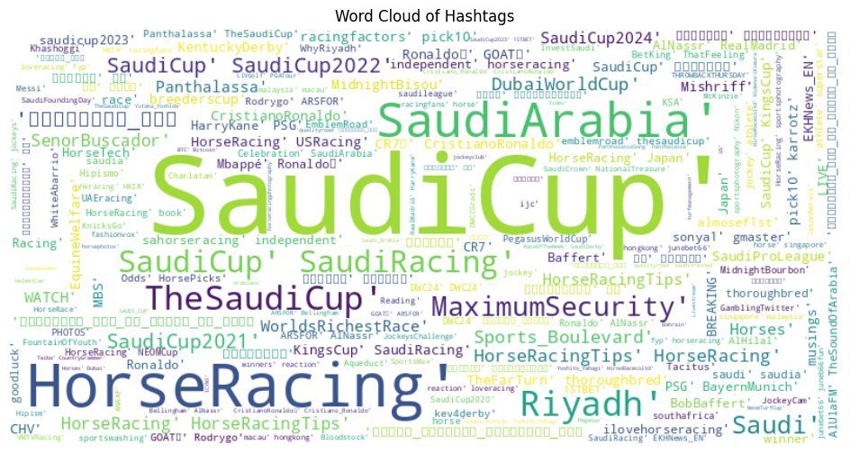

# Introduction to the Saudi Horse Cup

- Prestigious international equestrian event held annually in Saudi Arabia
- Launched in 2020, quickly becoming one of the world's richest horse races
- Features top thoroughbreds and jockeys from around the globe
- Total prize purse of $35.35 million as of 2024
- Showcases Saudi Arabia's commitment to sports and international events

---

# Project Overview

- **Aim**: Analyze global sentiment towards the Saudi Horse Cup using social media data
- **Objectives**:
  - Collect and analyze tweets related to the event
  - Identify prevailing opinions and sentiment trends
  - Uncover geographical variations in public perception
  - Provide actionable insights for event organizers and stakeholders

---

# Data Collection

- **Source**: Twitter (Platform X) platform
- **Method**: Twikit library for efficient data scraping
- **Timeframe**: 2024-02-20 - 2024-03-05
- **Keywords**: "Saudi Horse Cup", "#SaudiCup", "Saudi racing", etc.
- **Dataset**: 5042 rows.

---

# Data Exploration

- Dataset structure: 16 columns including tweet text, user info, and engagement metrics
- Key features: Tweet content, timestamp, user location, retweet/like counts
- Initial observations:
  - High engagement during event dates
  - Diverse geographical participation
  - Mix of English and Arabic tweets

---

# Data Preprocessing

- Text cleaning:
  - Removing special characters and URLs
  - Standardizing text (lowercase, removing extra spaces)
- Handling missing data and duplicates

---

# Language Distribution

- English tweets dominant at 99.8%
- Arabic second most common at 0.2%
- Focus on English tweets for in-depth analysis
- Insight: Event's international appeal and reach

---

# Tweet Activity Over Time

- Peak activity observed on 2024-02-24 
- Implications for future event promotion and engagement strategies

---

# Popular Hashtags

- Most frequent: #SaudiCup, #HorseRacing, #SaudiArabia
- Insights for future marketing and audience engagement

---

# Geographical Analysis

---

# Sentiment Analysis Approach

- Utilized BERT (Bidirectional Encoder Representations from Transformers) model
- Advantages of BERT:
  - Contextual understanding of language
  - Pre-trained on large corpus, fine-tuned for our task
  - State-of-the-art performance in NLP tasks

---

# Sentiment Analysis Results

- Overall sentiment breakdown:
  - Positive: 99.8%
  - Neutral: 0.2%
- Comparison to initial expectations

---

# Conclusion and Future Work

- Recap: Valuable insights gained through data-driven analysis
- Limitations: Twitter-only data, potential bias in social media representation
- Future directions:
  - Incorporate multi-platform data (Instagram, Facebook)
  - Longitudinal study across multiple years
  - Advanced NLP techniques for nuanced sentiment analysis
- Call to action: Integrate these insights into strategic planning for future Saudi Cup events