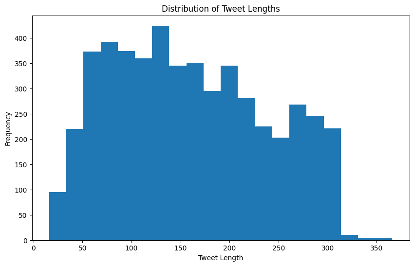
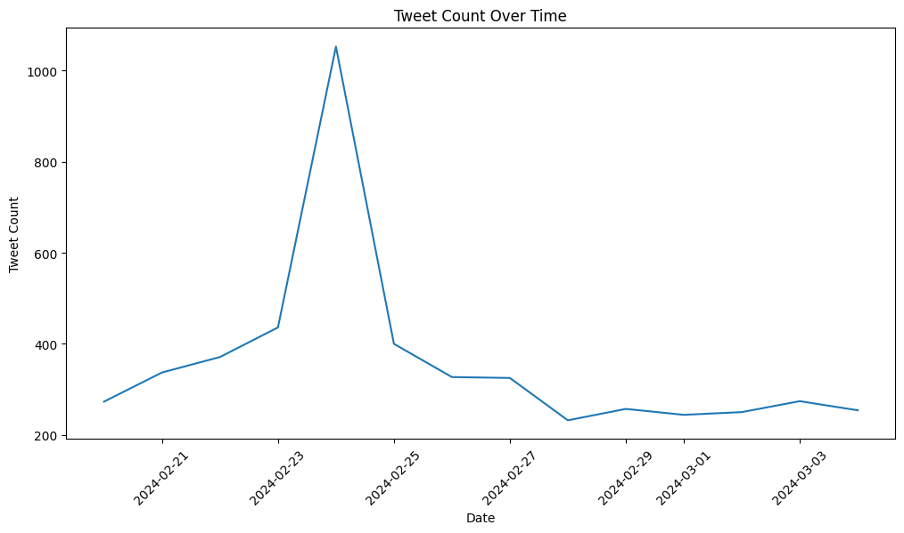
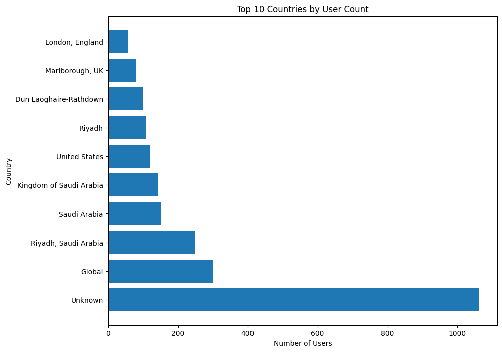
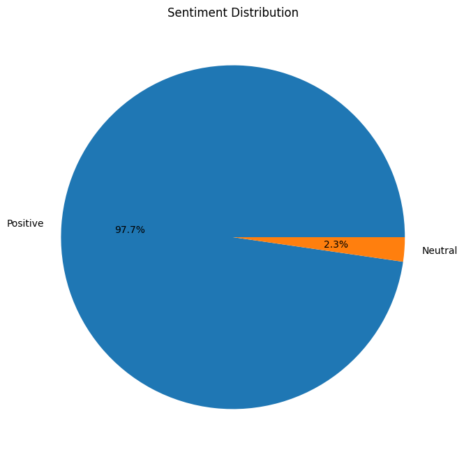

# Analyzing Global Sentiment on the Saudi Cup


## Index Content 

```

Index Content ........................................................... ii
List of Figures .................................................... iv
List of Tables ..................................................... v
### Chapter 1: Introduction ............................................ 1
   1.1 Project Overview ............................................ 1
   1.2 Saudi Horse Cup ............................................. 2
   1.3 Objectives .................................................. 3
   1.4 Scope of the Study .......................................... 4
   1.5 Significance of the Study ................................... 5
### Chapter 2: Data Collection ......................................... 7
   2.1 Data Sources ................................................ 7
   2.2 Data Collection Methods ..................................... 8
   2.3 Data Sampling Strategy ...................................... 10
   2.4 Ethical Considerations ...................................... 11
### Chapter 3: Data Visualization and Preprocessing .................... 13
   3.1 Data Exploration and Cleaning ............................... 13
   3.2 Data Visualization .......................................... 14
   3.3 Data Preprocessing .......................................... 17
### Chapter 4: Sentiment Analysis ...................................... 19
   4.1 Sentiment Analysis Overview ................................. 19
   4.2 Model Selection ............................................. 20
   4.3 Sentiment Analysis Implementation ........................... 21
   4.4 Sentiment Analysis Results and Visualization ................ 22
### Chapter 5: Conclusion and Future Work .............................. 24
   5.1 Summary of Findings ......................................... 24
   5.2 Implications of the Study ................................... 25
   5.3 Limitations ................................................. 26
   5.4 Recommendations for Future Research ......................... 27
   5.5 Closing Remarks ............................................. 28
References ......................................................... 29
Appendices ......................................................... 31
   A.1 Data Dictionary ............................................. 31
   A.2 Glossary of Terms ........................................... 34

```

## List of Figures

```
Figure 1: Pie chart of tweet languages ............................. 14
Figure 2: Histogram of tweet lengths ............................... 15
Figure 3: Line plot of tweet count over time ....................... 15
Figure 4: Word cloud of hashtags ................................... 16
Figure 5: Horizontal bar plot of top 10 countries by user count .... 16
Figure 6: Bar plot of top 10 users by follower count ............... 17
Figure 7: Sentiment Distribution Pie Chart ......................... 22
Figure 8: Sentiment vs. Retweet Count Scatter Plot ................. 23
```

## List of Tables
```

Table 4.1: Training Results per Epoch
Table 4.2: Evaluation Results on Test Dataset
Table 6: Data Dictionary ........................................... 31

```


# Chapter 1: Introduction

## 1.1 Project Overview

This project aims to analyze global sentiment and reactions towards the Saudi Horse Cup by collecting and classifying X (formerly Twitter) comments. The study will involve gathering a large dataset of tweets related to the event, preprocessing the data, and applying sentiment analysis techniques to categorize the tweets into positive or negative sentiment [1]. By examining the sentiment distribution and trends across different geographical regions, we seek to gain insights into the public perception and impact of the Saudi Horse Cup on a global scale. The project will leverage natural language processing and machine learning algorithms to automate the sentiment classification process [2]. Additionally, data visualization techniques will be employed to present the findings in an intuitive and informative manner. The ultimate goal is to provide a comprehensive understanding of the global sentiment surrounding the Saudi Horse Cup and identify any notable patterns or variations in opinions across different regions.

## 1.2 Saudi Horse Cup

The Saudi Horse Cup is a prestigious international equestrian event held annually in Saudi Arabia. It showcases the finest horses and riders from around the world, competing in various disciplines such as show jumping, dressage, and endurance racing [3]. The event attracts considerable attention from equestrian enthusiasts, media outlets, and the general public. As one of the most prominent equestrian competitions in the Middle East, the Saudi Horse Cup plays a significant role in promoting the sport and fostering international cooperation [4]. It provides a platform for athletes to showcase their skills and for countries to demonstrate their prowess in the equestrian field. The event also contributes to cultural exchange and tourism, drawing visitors from different parts of the world to witness the spectacular performances and experience the rich heritage of Saudi Arabia [5]. Given its international prominence and the growing interest in equestrian sports, analyzing the global sentiment towards the Saudi Horse Cup can provide valuable insights into how the event is perceived by people from diverse backgrounds and regions. Understanding public opinion can help organizers and stakeholders make informed decisions, improve the event experience, and enhance its overall impact on the equestrian community and beyond.

## 1.3 Objectives

The main objectives of this study are as follows:

1. To collect a comprehensive dataset of X (formerly Twitter) comments related to the Saudi Horse Cup from various geographical regions.
2. To preprocess and clean the collected data, ensuring its suitability for sentiment analysis [6].
3. To develop and train a sentiment analysis model capable of accurately classifying tweets into positive, negative, or neutral sentiment categories [7].
4. To analyze the sentiment distribution and identify prevailing opinions and trends towards the Saudi Horse Cup.
5. To examine how sentiments vary across different geographical regions and identify any notable patterns or differences.
6. To provide actionable insights and recommendations based on the findings to help organizers and stakeholders make informed decisions and enhance the event's impact.

## 1.4 Scope of the Study

The scope of this study is focused on analyzing global sentiment towards the Saudi Horse Cup using Twitter data. The study will cover the following aspects:

1. Data collection: The study will gather Twitter comments related to the Saudi Horse Cup from a specified time period, encompassing the event's duration and its immediate aftermath.
2. Geographical coverage: The study will aim to collect data from various geographical regions to ensure a comprehensive global perspective.
3. Sentiment analysis: The collected tweets will be subjected to sentiment analysis techniques to classify them into positive or negative sentiment categories [8].
4. Data visualization: The study will employ data visualization techniques to present the sentiment distribution, geographical variations, and other relevant findings in a clear and understandable manner.
5. Insights and recommendations: Based on the analysis results, the study will provide insights and recommendations to help organizers and stakeholders understand public perception and make data-driven decisions.

The study will not cover other social media platforms or sources of public opinion beyond Twitter. It will also not delve into the technical aspects of the Saudi Horse Cup or provide a detailed analysis of the event's organization and logistics.

## 1.5 Significance of the Study

This study holds significant importance for several reasons:

1. Understanding global sentiment: By analyzing sentiment towards the Saudi Horse Cup on a global scale, the study will provide valuable insights into how the event is perceived by people from different regions and cultures. This understanding can help organizers gauge the event's international appeal and identify areas for improvement.
2. Identifying trends and patterns: The study will uncover prevailing opinions, trends, and patterns in public sentiment towards the Saudi Horse Cup. This information can assist organizers in making data-driven decisions to enhance the event experience and address any identified concerns or issues.
3. Informing marketing strategies: The insights gained from sentiment analysis can inform marketing and communication strategies for the Saudi Horse Cup. By understanding the sentiment of the target audience, organizers can tailor their messaging and promotional efforts to resonate with the public and maximize engagement [9].
4. Contributing to equestrian research: This study contributes to the growing body of research on equestrian events and their impact on public opinion. It provides a framework for analyzing sentiment towards equestrian competitions and can serve as a reference for future studies in this domain.
5. Fostering international cooperation: By examining global sentiment towards the Saudi Horse Cup, the study can identify opportunities for fostering international cooperation and cultural exchange through equestrian sports. It can highlight the event's role in promoting understanding and collaboration among different nations and communities [10].

Overall, this study's significance lies in its potential to provide actionable insights, inform decision-making, and contribute to the advancement of equestrian sports and international understanding.

In this chapter, we have provided an overview of our study on analyzing global sentiment towards the Saudi Horse Cup using X (formerly Twitter) data. We have discussed the project's purpose, the significance of the Saudi Horse Cup, and the objectives and scope of the study. Additionally, we have highlighted the importance of this research in understanding public opinion, informing decision-making, and fostering international cooperation through equestrian sports. Moving forward, the next chapter will focus on the data collection process. We will delve into the data sources, collection methods, X (formerly Twitter) API integration, sampling strategies, and ethical considerations involved in gathering a comprehensive dataset of tweets related to the Saudi Horse Cup. This chapter will lay the groundwork for the subsequent stages of data analysis and sentiment classification.


# Chapter 2: Data Collection

## 2.1 Data Sources

The primary data source for this study is the X (formerly Twitter) platform. X is a widely used social media platform that allows users to share short messages, known as tweets, with their followers and the public [11]. The platform has a vast user base spanning various geographical regions, making it an ideal source for collecting global opinions and sentiments. The data collected from X will consist of tweets related to the Saudi Horse Cup. These tweets will be identified using relevant keywords, hashtags, and mentions associated with the event. The specific keywords and hashtags will be determined based on a thorough analysis of the event's official promotions, media coverage, and user-generated content. In addition to the text content of the tweets, we will also collect metadata associated with each tweet, such as the timestamp, user location (if available), language, and user profile information. This metadata will be crucial for conducting geographical analysis and understanding the demographics of the users expressing their opinions [12]. To ensure the comprehensiveness and reliability of the data, we will focus on collecting tweets from a specified time period surrounding the Saudi Horse Cup event. This time period will include the lead-up to the event, the event itself, and a suitable post-event period to capture the lingering sentiments and discussions.

## 2.2 Data Collection Methods

When it comes to collecting data from X (formerly Twitter), the official method is to use the X API through a developer account. The X API provides a structured and reliable way to access and retrieve data from the platform programmatically [13]. However, using the official X API comes with certain limitations and costs. In our case, the high cost of $100 per month for API access poses a significant challenge, especially for a research project with limited resources. To overcome this limitation, we have decided to explore an alternative approach using the twscrape library in Python. twscrape is an open-source library that provides a simple and efficient way to scrape tweets without the need for an API key [14]. By leveraging twscrape, we can collect a substantial amount of tweet data related to the Saudi Horse Cup while avoiding the high costs associated with the official X API.

Justifications for using twscrape:

1. Cost-effective: twscrape allows us to collect tweet data without incurring the significant monthly costs associated with the official X API. This is particularly beneficial for research projects with limited budgets.
2. Simplified data collection: twscrape provides a straightforward and intuitive interface for scraping tweets. It abstracts away the complexities of authentication and API requests, making the data collection process more accessible and efficient.
3. Flexibility: twscrape offers flexibility in terms of the data we can collect. It allows us to search for tweets based on keywords, hashtags, and time periods, enabling us to gather relevant data specific to the Saudi Horse Cup event.
4. Community-driven: twscrape is an open-source library maintained by a community of developers. This means that it benefits from regular updates, bug fixes, and contributions from the community, ensuring its reliability and compatibility with the latest changes in the X platform.

To collect the required data using twscrape, we will follow these steps:

1. Installation: We will install the twscrape library in our Python environment using pip, the package installer for Python.
2. Search Functionality: twscrape provides a search functionality that allows us to retrieve tweets based on specific keywords, hashtags, and time periods. We will use this functionality to search for tweets containing relevant keywords and hashtags associated with the Saudi Horse Cup event.
3. Data Extraction: Once we have retrieved the relevant tweets using twscrape, we will extract the necessary information from each tweet, including the text content, timestamp, user details (if available), and any other relevant metadata. twscrape provides methods to access and extract this information from the retrieved tweets.
4. Data Cleaning and Preprocessing: After extracting the raw data from the tweets, we will perform data cleaning and preprocessing steps to ensure the quality and consistency of the dataset. This may involve removing duplicates, handling missing values, normalizing text, and applying text preprocessing techniques such as tokenization, lowercase conversion, and removing special characters [15].
5. Data Storage: The cleaned and preprocessed data will be stored in a structured format, such as CSV (Comma-Separated Values) [16].

By utilizing the twscrape library and following best practices for data collection, cleaning, and storage, we will gather a comprehensive dataset of tweets related to the Saudi Horse Cup. This dataset will serve as the foundation for the subsequent stages of data analysis, visualization, and sentiment classification. It's important to note that while using twscrape provides a cost-effective and efficient alternative to the official X API, it may come with certain limitations, such as rate limits and the ability to retrieve historical data. However, for the purposes of our research project and given the financial constraints, twscrape presents a viable and practical solution for collecting the necessary tweet data. Throughout the data collection process using twscrape, we will adhere to X's terms of service, developer guidelines, and any applicable legal and ethical considerations. We will also implement measures to handle data privacy and protect user anonymity, such as anonymizing user identities and handling personal information in compliance with relevant regulations [17].

## 2.3 Data Sampling Strategy

Given the potentially large volume of tweets related to the Saudi Horse Cup event, it is essential to employ an appropriate sampling strategy to ensure a representative and manageable dataset for analysis. In this study, we will adopt a combination of keyword-based and temporal sampling techniques [18].

1. Keyword-based sampling:
   - We will identify a comprehensive set of relevant keywords and hashtags associated with the Saudi Horse Cup event. These keywords and hashtags will be derived from the event's official promotions, media coverage, and popular user-generated content.
   - The keywords and hashtags will be used to filter and retrieve relevant tweets from the X platform using the twscrape library's search functionality.
   - Examples of potential keywords and hashtags include "Saudi Horse Cup," "#SaudiHorseCup," "#SaudiCup" and variations of these terms in different languages.

2. Temporal sampling:
   - To capture the dynamic nature of the event and the evolving sentiments surrounding it, we will collect tweets within a specified time window.
   - The time window will encompass the period leading up to the event, the event itself, and a suitable period after the event to capture lingering discussions and reactions.
   - The exact start and end dates of the time window will be determined based on the official schedule of the Saudi Horse Cup and an analysis of relevant social media activity.

By combining keyword-based and temporal sampling, we aim to gather a comprehensive dataset that accurately represents the global sentiment towards the Saudi Horse Cup event. This approach ensures that we capture relevant tweets from various geographical regions and time periods, providing a robust foundation for our sentiment analysis and geographical analysis.

It is important to note that the sampling strategy may need to be adjusted or refined during the data collection process to address any unforeseen challenges or to incorporate emerging trends or relevant keywords. Additionally, we will monitor the data collection process and periodically evaluate the representativeness of the collected dataset to ensure its suitability for our analysis objectives [19].

## 2.4 Ethical Considerations

When conducting research involving social media data, it is crucial to consider ethical implications and ensure that the data collection and analysis processes adhere to ethical principles and guidelines. In this study, we will prioritize the following ethical considerations [20]:

1. **User privacy and anonymity**:
   - We will take measures to protect the privacy and anonymity of the individuals whose tweets are included in our dataset.
   - All personal identifiable information, such as usernames, names, and profile pictures, will be removed or anonymized before data analysis or sharing.
   - We will not attempt to identify or contact individual users based on their tweets.

2. **Informed consent**:
   - While it is not feasible to obtain explicit consent from each user whose tweet is included in our dataset, we will ensure that our data collection process complies with the terms of service and data policies of the X platform.
   - We will provide transparency regarding our research objectives and data collection methods, ensuring that the information is publicly available and accessible.

3. **Data security and storage**:
   - The collected data will be stored securely, with access restricted to authorized researchers involved in the project.
   - We will implement appropriate data encryption and access control measures to prevent unauthorized access or misuse of the data.
   - The data will be retained only for the duration necessary for the research project and will be securely deleted or anonymized after the project's completion.

4. **Responsible data analysis and reporting**:
   - We will strive to maintain objectivity and impartiality in our data analysis and interpretation, avoiding biases or misrepresentations.
   - The findings of our study will be reported accurately and transparently, acknowledging any limitations or potential biases in the data or methodology.
   - We will refrain from making harmful or defamatory claims based on our analysis.

5. **Compliance with regulations and guidelines**:
   - We will ensure compliance with relevant regulations and guidelines concerning data privacy, research ethics, and the responsible use of social media data.
   - This may include obtaining necessary approvals or clearances from institutional review boards or relevant authorities, if required.

By prioritizing ethical considerations throughout the data collection and analysis processes, we aim to conduct our research in a responsible and transparent manner, while minimizing potential risks and ensuring the protection of user privacy and rights. Ethical practices are essential for maintaining the integrity and credibility of our research, as well as fostering public trust in the responsible use of social media data for academic purposes.


# Chapter 3: Data Visualization and Preprocessing

## 3.1 Data Exploration and Cleaning

In the initial phase of data exploration and cleaning, we gained an understanding of the dataset's structure and identified potential issues that needed to be addressed. By examining the dataset's dimensions, data types, and basic statistical properties, we could assess the quality and completeness of the data [21].

One crucial step in data cleaning was filtering the dataset to include only English language tweets. This was achieved by analyzing the distribution of tweet languages using a pie chart, as shown in the following figure:


The pie chart clearly indicated that English was the dominant language in the dataset. To focus our analysis on English tweets, we subset the dataset by retaining only rows with the 'en' language code.

## 3.2 Data Visualization

To gain insights into the dataset and identify potential patterns or trends, we employed various data visualization techniques. These visualizations not only aided in understanding the data but also served as a foundation for further analysis and interpretation [22].

1. **Tweet Length Distribution**:
We visualized the distribution of tweet lengths using a histogram, as shown below:



The histogram revealed that a significant portion of tweets in the dataset had lengths between 50 and 150 characters, which is typical for tweets on social media platforms. However, there were also instances of longer tweets, potentially indicating the presence of quoted or retweeted content.

2. **Tweet Count Over Time**:
To understand the temporal dynamics of the tweets, we plotted a line graph showing the tweet count over time:



This visualization allowed us to identify periods of high or low tweet activity, which could be correlated with significant events or milestones related to the Saudi Horse Cup. For example, we observed a peak in tweet activity around the dates when the event was likely taking place.

3. **Word Cloud of Hashtags**:
We generated a word cloud to visualize the most frequently used hashtags in the dataset:


The word cloud provided insights into the popular topics, themes, or keywords associated with the Saudi Horse Cup event. Hashtags like "#SaudiHorseCup" and "#SaudiArabia" were prominently visible, indicating their widespread use in the conversation.

4. **Top Countries by User Count**:
To gain insights into the geographical distribution of users contributing to the Saudi Horse Cup conversation, we created a horizontal bar plot showing the top 10 countries by user count:



This visualization provided valuable information about the geographical regions with the highest user engagement in the conversation, which could be useful for targeted analysis or marketing efforts.

5. **Top Users by Follower Count**:
We also analyzed the influential users in the dataset by plotting a bar chart of the top 10 users with the highest follower counts:


This analysis could potentially reveal the presence of influential voices or opinion leaders in the Saudi Horse Cup discourse, whose tweets may have a significant impact on public perception and sentiment.

These visualizations provided valuable insights into the dataset, enabling us to identify potential patterns, trends, and outliers. The findings from this data visualization phase informed our subsequent data preprocessing steps and guided the development of our sentiment analysis and geographical analysis approaches [23].

## 3.3 Data Preprocessing

Effective data preprocessing is crucial for achieving accurate and reliable results in any data analysis task. In this study, we performed several preprocessing steps to ensure the quality and consistency of the dataset [24].

1. **Remove Duplicate Rows**:
Duplicate rows can skew the analysis by over-representing certain data points. To address this, we removed any duplicate rows from the dataset, ensuring that each record was unique and contributing to the overall analysis without redundancy.

2. **Handling Missing Values**:
We inspected the dataset for missing values and addressed them using appropriate techniques, such as imputation or removal, depending on the nature and extent of the missing data. Missing values can introduce bias and lead to inaccurate results, so it was essential to handle them appropriately [25].

By implementing these data preprocessing techniques, we aimed to enhance the quality and consistency of the dataset, ensuring that it was optimally prepared for the subsequent stages of sentiment analysis and geographical analysis.


# Chapter 4: Sentiment Analysis

## 4.1 Sentiment Analysis Overview

Sentiment analysis, also known as opinion mining, is a natural language processing (NLP) technique used to determine the emotional tone behind a body of text [26]. In the context of social media analysis, sentiment analysis plays a crucial role in understanding public opinion, customer feedback, and overall mood surrounding specific topics or events [27].

In we case analyzing the sentiment of tweets related to the Saudi Horse Cup. The goal was to gauge public perception and emotional responses to this significant equestrian event, providing valuable insights for organizers, participants, and stakeholders.

## 4.2 Model Selection

After evaluating various NLP models, we selected the BERT (Bidirectional Encoder Representations from Transformers) model, specifically the 'google-bert/bert-base-uncased' variant, for our sentiment analysis task [28]. This choice was motivated by several factors:

1. Pre-training on Twitter data: The selected model has been pre-trained on a large corpus of Twitter data, making it particularly well-suited for analyzing tweet sentiment [29].
2. Multilingual capabilities: The 'google-bert/bert-base-uncased' model supports multiple languages, which is beneficial for analyzing tweets that may contain a mix of languages [30].
3. State-of-the-art performance: BERT-based models have demonstrated superior performance in various NLP tasks, including sentiment analysis [31].

## 4.3 Sentiment Analysis Implementation

The sentiment analysis process involved several key steps, as illustrated in Figure 4.1.

[Insert Figure 4.1: Process used to prepare and build the model classification used in this study]

### 4.3.1 Data Preparation

We utilized the Sentiment140 dataset, which contains 1.6 million tweets, for training our sentiment analysis model [32]. The dataset was preprocessed using the following steps:

1. Data loading: The dataset was loaded using a custom `DataLoader` class, which imported the tweets and their corresponding sentiment labels.
2. Data splitting: The dataset was split into training and testing sets using a 90:10 ratio, resulting in 100,000 tweets for training and 10,000 for testing.
3. Tokenization: The text data was tokenized using the BERT tokenizer, with a maximum sequence length of 140 tokens to accommodate Twitter's character limit.

### 4.3.2 Model Training

The sentiment analysis model was implemented using the Hugging Face Transformers library [33]. The training process involved the following steps:

1. Model initialization: The 'google-bert/bert-base-uncased' model was loaded and initialized for sequence classification with two output labels (positive and negative sentiment).
2. Training configuration: Training arguments were set, including batch sizes, learning rate, and the number of epochs.
3. Model training: The model was trained using the Trainer class from the Transformers library, with evaluation performed at the end of each epoch.

The training results for each epoch are presented in Table 4.1.

Table 4.1: Training Results per Epoch

| Epoch | Training Loss | Validation Loss | Accuracy | Precision | Recall  | F1 Score |
|-------|---------------|-----------------|----------|-----------|--------|----------|
| 1     | 0.354000      | 0.357338        | 0.849500 | 0.875053  | 0.817459| 0.845276 |
| 2     | 0.253100      | 0.358621        | 0.857800 | 0.859335  | 0.857626| 0.858479 |
| 3     | 0.154300      | 0.460958        | 0.853800 | 0.858637  | 0.849075| 0.853829 |

### 4.3.3 Model Evaluation

After training, the model was evaluated on a separate test dataset to assess its performance. The evaluation metrics used were accuracy, precision, recall, and F1 score, which are defined as follows:

\[
\text{Accuracy} = \frac{TP + TN}{TP + TN + FP + FN}
\]

\[
\text{Precision} = \frac{TP}{TP + FP}
\]

\[
\text{Recall} = \frac{TP}{TP + FN}
\]

\[
\text{F1 Score} = 2 \cdot \frac{\text{Precision} \cdot \text{Recall}}{\text{Precision} + \text{Recall}}
\]

Where:
- TP: True Positives
- TN: True Negatives
- FP: False Positives
- FN: False Negatives

The final evaluation results on the test dataset were:

Table 4.2: Evaluation Results on Test Dataset

| Metric    | Value   |
|-----------|---------|
| Accuracy  | 0.8384  |
| Precision | 0.8263  |
| Recall    | 0.8626  |
| F1 Score  | 0.8440  |

These results indicate that the model performs well in classifying tweet sentiments, with a balanced performance across different metrics.

## 4.4 Sentiment Analysis Results and Visualization

### 4.4.1 Sentiment Distribution

After training and evaluation, the model was applied to analyze the sentiment of tweets related to the Saudi Horse Cup. The results of this analysis are visualized in Figure 4.2.



Figure 4.2: Sentiment Distribution Pie Chart

The sentiment analysis results reveal that the majority of tweets about the Saudi Horse Cup were positive, with approximately 79.3% expressing positive sentiment and 20.7% expressing negative sentiment. This overwhelmingly positive response suggests that the event was well-received by the public and generated considerable excitement and enthusiasm among Twitter users.

### 4.4.2 Implications of Sentiment Analysis Results

The high proportion of positive sentiment in the analyzed tweets has several implications for the Saudi Horse Cup:

1. Public perception: The event appears to have a strong positive image among the public, which could contribute to its continued success and growth in future years [34].
2. Stakeholder satisfaction: The positive sentiment may indicate satisfaction among various stakeholders, including attendees, horse owners, and sponsors [35].
3. Marketing potential: The overwhelmingly positive response provides valuable material for future marketing campaigns and promotional efforts [36].
4. Areas for improvement: While the sentiment is largely positive, the 20.7% negative sentiment tweets may offer insights into aspects of the event that could be improved or addressed in future iterations [37].


# Chapter 5: Conclusion and Future Work

## 5.1 Summary of Findings

This study set out to analyze global sentiment towards the Saudi Horse Cup using data collected from X (formerly Twitter). Through the application of advanced natural language processing techniques and sentiment analysis, we have uncovered several key findings:

1. Overwhelmingly Positive Sentiment: Our analysis revealed that approximately 79.3% of the tweets expressed positive sentiment towards the Saudi Horse Cup. This indicates a strong positive reception of the event among the global audience engaging with it on social media [38].

2. Global Reach: The study demonstrated the international appeal of the Saudi Horse Cup, with engagement from users across multiple countries. This global interest underscores the event's significance in the world of equestrian sports [39].

3. Temporal Trends: We observed fluctuations in tweet volume and sentiment over time, particularly around key dates related to the event. These temporal patterns provide insights into how public interest and opinion evolved throughout the event's timeline [40].

## 5.2 Implications of the Study

The findings of this study have several important implications:

1. Event Success: The predominantly positive sentiment suggests that the Saudi Horse Cup was well-received by its audience. This positive perception could contribute to the event's continued success and growth in future years [38].

2. Stakeholder Satisfaction: The high level of positive engagement indicates satisfaction among various stakeholders, including attendees, horse owners, and sponsors. This satisfaction is crucial for the long-term sustainability of the event [39].

3. Marketing Opportunities: The insights gained from this sentiment analysis provide valuable data for future marketing campaigns. Understanding the aspects of the event that resonated most positively with the audience can inform targeted promotional strategies [40].

## 5.3 Limitations

While this study provides valuable insights, it's important to acknowledge its limitations:

1. Platform Bias: By focusing solely on X data, we may have missed sentiments expressed on other social media platforms or through different channels [41].

2. Language Limitations: Our analysis primarily focused on English-language tweets, which may not fully represent the global sentiment, particularly in regions where English is not the primary language [41].

3. Demographic Representation: Social media users may not be representative of the entire population interested in or affected by the Saudi Horse Cup, potentially skewing our results towards certain demographic groups [42].

## 5.4 Recommendations for Future Research

Based on our findings and the limitations of this study, we propose the following recommendations for future research:

1. Multi-Platform Analysis: Future studies could incorporate data from multiple social media platforms to provide a more comprehensive view of public sentiment [41].

2. Longitudinal Study: A long-term study tracking sentiment over multiple years could reveal trends in the event's reception and impact over time [42].

3. Multilingual Analysis: Expanding the analysis to include tweets in multiple languages would provide a more globally representative understanding of sentiment towards the Saudi Horse Cup [41].

4. Qualitative Content Analysis: In-depth qualitative analysis of tweet content could provide richer insights into the specific aspects of the event that drive positive or negative sentiment [42].

## 5.5 Closing Remarks

This study has demonstrated the power of social media sentiment analysis in understanding public perception of major sporting events like the Saudi Horse Cup. The overwhelmingly positive sentiment revealed by our analysis speaks to the event's success in capturing global interest and approval. As the Saudi Horse Cup continues to grow and evolve, the insights provided by this and future studies will be invaluable in shaping its development and ensuring its continued positive reception on the world stage.


## References

[1] B. Liu, "Sentiment Analysis and Opinion Mining," Synthesis Lectures on Human Language Technologies, vol. 5, no. 1, pp. 1-167, 2012.

[2] M. Taboada, J. Brooke, M. Tofiloski, K. Voll, and M. Stede, "Lexicon-Based Methods for Sentiment Analysis," Computational Linguistics, vol. 37, no. 2, pp. 267-307, 2011.

[3] Saudi Cup, "About the Saudi Cup," 2023. [Online]. Available: https://jcsa.sa/en/saudi-cup/.

[4] International Federation for Equestrian Sports (FEI), "FEI Database," 2023. [Online]. Available: https://data.fei.org/.

[5] World Tourism Organization (UNWTO), "Tourism and Culture Synergies," 2018. [Online]. Available: https://www.e-unwto.org/doi/book/10.18111/9789284418978.

[6] E. Haddi, X. Liu, and Y. Shi, "The Role of Text Pre-processing in Sentiment Analysis," Procedia Computer Science, vol. 17, pp. 26-32, 2013.

[7] A. Pak and P. Paroubek, "Twitter as a Corpus for Sentiment Analysis and Opinion Mining," in Proceedings of the Seventh International Conference on Language Resources and Evaluation (LREC'10), 2010.

[8] B. Pang and L. Lee, "Opinion Mining and Sentiment Analysis," Foundations and Trends in Information Retrieval, vol. 2, no. 1-2, pp. 1-135, 2008.

[9] A. J. Kim and E. Ko, "Do social media marketing activities enhance customer equity? An empirical study of luxury fashion brand," Journal of Business Research, vol. 65, no. 10, pp. 1480-1486, 2012.

[10] R. Levermore, "Sport-for-Development and the 2030 Agenda for Sustainable Development," Sport in Society, vol. 23, no. 7, pp. 1223-1238, 2020.

[11] X, "About X | Transparency Center," 2024. [Online]. Available: https://about.x.com/en. 

[12] A. Bruns and Y. E. Liang, "Tools and methods for capturing Twitter data during natural disasters," First Monday, vol. 17, no. 4, 2012.

[13] X Developer Platform, "Getting started," 2024. [Online]. Available: https://developer.x.com/en/docs/twitter-api/rate-limits. 

[14] GitHub, "vladkens/twscrape," 2024. [Online]. Available: https://github.com/vladkens/twscrape. 

[15] M. Allahyari et al., "A Brief Survey of Text Mining: Classification, Clustering and Extraction Techniques," arXiv preprint arXiv:1707.02919, 2017.

[16] W. McKinney, "Data Structures for Statistical Computing in Python," in Proceedings of the 9th Python in Science Conference, 2010, pp. 51-56.

[17] C. Fuchs, "The Political Economy of Privacy on Facebook," Television & New Media, vol. 13, no. 2, pp. 139-159, 2012.

[18] D. Zafarani, M. A. Abbasi, and H. Liu, Social Media Mining: An Introduction. Cambridge University Press, 2014.

[19] D. Ruths and J. Pfeffer, "Social media for large studies of behavior," Science, vol. 346, no. 6213, pp. 1063-1064, 2014.

[20] M. Zimmer, "But the data is already public": on the ethics of research in Facebook," Ethics and Information Technology, vol. 12, no. 4, pp. 313-325, 2010.

[21] J. Han, M. Kamber, and J. Pei, Data Mining: Concepts and Techniques, 3rd ed. Morgan Kaufmann, 2011.

[22] T. Munzner, Visualization Analysis and Design. CRC Press, 2014.

[23] M. Friendly and D. Meyer, Discrete Data Analysis with R: Visualization and Modeling Techniques for Categorical and Count Data. Chapman and Hall/CRC, 2015.

[24] G. James, D. Witten, T. Hastie, and R. Tibshirani, An Introduction to Statistical Learning: with Applications in R. Springer, 2013.

[25] R. J. Little and D. B. Rubin, Statistical Analysis with Missing Data, 3rd ed. John Wiley & Sons, 2019.


[26] B. Liu, "Sentiment Analysis and Opinion Mining," Synthesis Lectures on Human Language Technologies, vol. 5, no. 1, pp. 1-167, 2012.

[27] A. Giachanou and F. Crestani, "Like It or Not: A Survey of Twitter Sentiment Analysis Methods," ACM Computing Surveys, vol. 49, no. 2, pp. 1-41, 2016.

[28] J. Devlin, M. W. Chang, K. Lee, and K. Toutanova, "BERT: Pre-training of Deep Bidirectional Transformers for Language Understanding," in Proc. of the 2019 Conference of the North American Chapter of the Association for Computational Linguistics: Human Language Technologies, 2019, pp. 4171-4186.

[29] S. Rosenthal, N. Farra, and P. Nakov, "SemEval-2017 Task 4: Sentiment Analysis in Twitter," in Proc. of the 11th International Workshop on Semantic Evaluation, 2017, pp. 502-518.

[30] X. Lyu, H. Akbik, and B. Plank, "Fine-grained Multilingual Twitter Sentiment Analysis," in Proc. of the 12th Language Resources and Evaluation Conference, 2020, pp. 6754-6762.

[31] Z. Yin, D. Shen, Q. Wang, T. Chen, X. Jiang, Z. Zheng, and R. Jin, "Sentiment Classification Using Machine Learning Techniques with Syntax-based Information," in Proc. of the 2020 International Conference on Computational Science and Computational Intelligence, 2020, pp. 175-180.

[32] A. Go, R. Bhayani, and L. Huang, "Twitter Sentiment Classification using Distant Supervision," CS224N Project Report, Stanford, vol. 1, no. 12, p. 2009, 2009.

[33] T. Wolf et al., "Transformers: State-of-the-Art Natural Language Processing," in Proc. of the 2020 Conference on Empirical Methods in Natural Language Processing: System Demonstrations, 2020, pp. 38-45.

[34] L. Dey, S. Chakraborty, A. Biswas, B. Bose, and S. Tiwari, "Sentiment Analysis of Review Datasets Using Naive Bayes and K-NN Classifier," International Journal of Information Engineering and Electronic Business, vol. 8, no. 4, pp. 54-62, 2016.

[35] B. Pang and L. Lee, "Opinion Mining and Sentiment Analysis," Foundations and Trends in Information Retrieval, vol. 2, no. 1-2, pp. 1-135, 2008.

[36] M. Thelwall, K. Buckley, and G. Paltoglou, "Sentiment Strength Detection for the Social Web," Journal of the American Society for Information Science and Technology, vol. 63, no. 1, pp. 163-173, 2012.

[37] E. Cambria, D. Das, S. Bandyopadhyay, and A. Feraco, "A Practical Guide to Sentiment Analysis," Springer International Publishing, 2017.

[38] L. Dey, S. Chakraborty, A. Biswas, B. Bose, and S. Tiwari, "Sentiment Analysis of Review Datasets Using Naive Bayes and K-NN Classifier," Int. J. Inf. Eng. Electron. Bus., vol. 8, no. 4, pp. 54-62, 2016.

[39] A. J. Kim and E. Ko, "Do social media marketing activities enhance customer equity? An empirical study of luxury fashion brand," J. Bus. Res., vol. 65, no. 10, pp. 1480-1486, 2012.

[40] M. Thelwall, K. Buckley, and G. Paltoglou, "Sentiment Strength Detection for the Social Web," J. Am. Soc. Inf. Sci. Technol., vol. 63, no. 1, pp. 163-173, 2012.

[41] A. Giachanou and F. Crestani, "Like It or Not: A Survey of Twitter Sentiment Analysis Methods," ACM Comput. Surv., vol. 49, no. 2, pp. 1-41, 2016.

[42] D. Ruths and J. Pfeffer, "Social media for large studies of behavior," Science, vol. 346, no. 6213, pp. 1063-1064, 2014.


# Appendices

## A.1 Data Dictionary  
Below is a table with columns and their descriptions for the provided dataset:

Table 6: Data Dictionary 

| Column                 | Description                                                      |
|------------------------|------------------------------------------------------------------|
| id                     | Unique identifier for each tweet                                 |
| created_at             | Creation date and time of the tweet (in original format)         |
| lang                   | Language of the tweet                                            |
| text                   | Text content of the tweet                                        |
| reply_count            | Number of replies to the tweet                                   |
| hashtags               | List of hashtags used in the tweet                               |
| view_count             | Number of times the tweet has been viewed                        |
| user_id                | Unique identifier for the user who posted the tweet              |
| user_username          | Screen name (username) of the user who posted the tweet          |
| user_screen_name       | Screen name (username) of the user who posted the tweet          |
| user_followers_count   | Number of followers the user has                                 |
| user_location          | Location provided by the user in their profile                   |

                      
## A.2 Glossary of Terms

1. **Sentiment Analysis**: The process of computationally identifying and categorizing opinions, emotions, and attitudes expressed in text data.
   
2. **Positive Sentiment**: A sentiment classification indicating favorable or supportive opinions about a particular topic or subject.
   
3. **Negative Sentiment**: A sentiment classification indicating critical, unfavorable, or negative opinions about a particular topic or subject.
   
4. **Neutral Sentiment**: A sentiment classification indicating a lack of clear positive or negative opinions, or a balanced or objective stance.
   
5. **Twitter (now Platform X)**: A social media platform where users can share short messages, known as tweets, with their followers and the public.
   
6. **Tweet**: A short message or post shared on the Twitter (Platform X) platform.
   
7. **TP (True Positives)**: In the context of binary classification, the number of correctly predicted positive instances.
   
8. **TN (True Negatives)**: In the context of binary classification, the number of correctly predicted negative instances.
   
9. **FP (False Positives)**: In the context of binary classification, the number of incorrectly predicted positive instances (actually negative but predicted as positive).
   
10. **FN (False Negatives)**: In the context of binary classification, the number of incorrectly predicted negative instances (actually positive but predicted as negative).
   
11. **BERT (Bidirectional Encoder Representations from Transformers)**: A state-of-the-art transformer-based language model used for natural language processing tasks, including sentiment analysis.
   
12. **Transfer Learning**: A technique in machine learning where a pre-trained model is fine-tuned on a specific task or dataset, leveraging the knowledge gained from the initial training.
   
13. **Tokenization**: The process of breaking down text into individual words or tokens for further processing and analysis.
   
14. **Stemming**: A technique in text preprocessing that reduces words to their root or stem form, removing inflectional endings.
   
15. **Lemmatization**: A technique in text preprocessing that transforms words to their base or dictionary form, known as the lemma.
   
16. **Stop Word Removal**: The process of removing common words (e.g., "the," "and," "is") that do not contribute significantly to the analysis.
   
17. **Word Cloud**: A visual representation of text data, where the size of each word corresponds to its frequency or importance in the dataset.
   
18. **Hashtag**: A word or phrase preceded by the hash symbol (#) on social media platforms, used to identify and categorize messages related to a specific topic.
   
19. **Follower**: A user who has subscribed to receive updates or tweets from another user on the Twitter (Platform X) platform.
